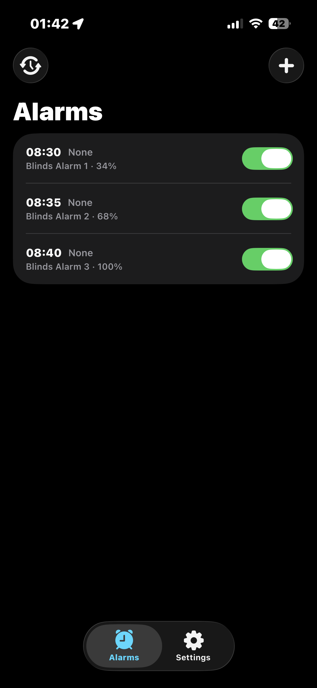
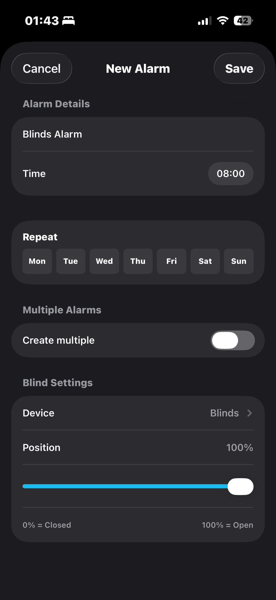
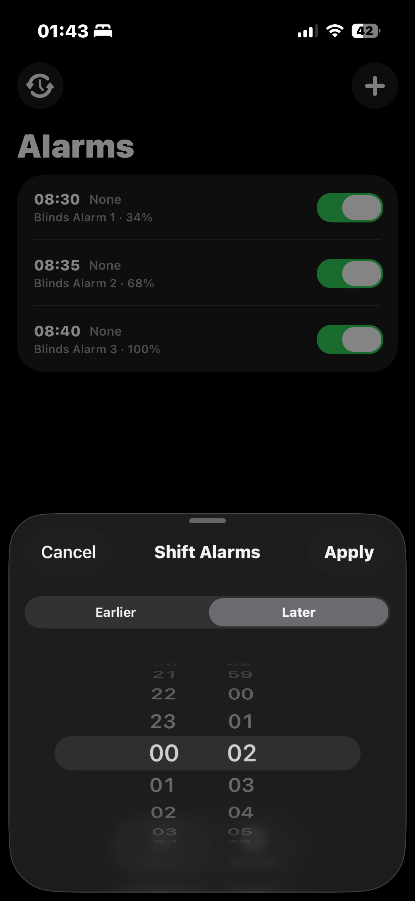
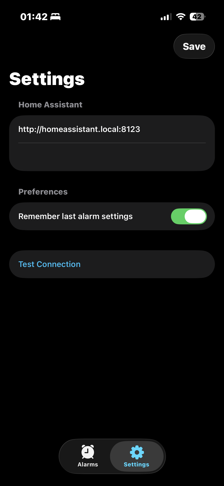

# HAlarm

An iOS app for scheduling smart blind automations in [Home Assistant](https://www.home-assistant.io/) tailored for my use case.

## Screenshots

<p>
  
  
  
  
</p>

## What it does

HAlarm lets you create, edit, and manage timed automations that open or close your Home Assistant cover entities (blinds, shutters, etc.) at specific times. Alarms are stored as native HA automations — the app is just a convenient front-end.

### Devices

This app was tested with the following devices during development:

- [SONOFF MINI-RBS](https://sonoff.tech/en-pt/products/sonoff-smart-roller-shutter-switch-mini-rbs)
- [SONOFF MINI-ZBRBS](https://sonoff.tech/en-pt/products/sonoff-zigbee-smart-roller-shutter-switch-mini-zbrbs)

## Requirements

- iOS 26+
- Home Assistant instance accessible on your local network
- The [HAlarm custom integration](ha_integration/) installed in your HA config directory
  - The purpose of this integration is to read the `automations.yaml` file and serve it over a REST endpoint in JSON format, as Home Assistant does not expose the list of automations in their API.
- A long-lived access token from your HA profile

## Setup

1. Copy `ha_integration/custom_components/halarm/` to your HA `config/custom_components/` directory
2. Add `halarm:` to your `configuration.yaml` and restart Home Assistant
3. Open the app, enter your HA base URL (default: `http://homeassistant.local:8123`) and access token, tap **Done**

## Exporting an IPA

If you want to build and export an IPA locally, use Xcode or `xcodebuild` on a Mac that already has the correct Apple signing setup.

### Xcode

1. Open `halarm.xcodeproj` in Xcode
2. Select the `halarm` scheme
3. Choose **Any iOS Device (arm64)** or a generic iOS destination
4. From the menu, choose **Product > Archive**
5. When the archive finishes, open the Organizer
6. Select the archive and choose **Distribute App**
7. Pick the export method that matches your signing profile and intended use
8. Export the IPA

### Command line

Archive:

```bash
xcodebuild \
  -project halarm.xcodeproj \
  -scheme halarm \
  -configuration Release \
  -destination "generic/platform=iOS" \
  -archivePath /tmp/halarm.xcarchive \
  -allowProvisioningUpdates \
  archive
```

Create an export options plist, for example:

```xml
<?xml version="1.0" encoding="UTF-8"?>
<!DOCTYPE plist PUBLIC "-//Apple//DTD PLIST 1.0//EN" "http://www.apple.com/DTDs/PropertyList-1.0.dtd">
<plist version="1.0">
<dict>
  <key>method</key>
  <string>debugging</string>
  <key>signingStyle</key>
  <string>automatic</string>
  <key>teamID</key>
  <string>YOUR_TEAM_ID</string>
</dict>
</plist>
```

Export:

```bash
xcodebuild \
  -exportArchive \
  -archivePath /tmp/halarm.xcarchive \
  -exportPath /tmp/halarm-ipa \
  -exportOptionsPlist /path/to/ExportOptions.plist \
  -allowProvisioningUpdates
```

The exported IPA will be written to `/tmp/halarm-ipa`.

## Features

- **Create alarms** — pick a time, weekdays, blind device, and target position
- **Create multiple alarms at once** — generate a sequence of alarms with configurable time intervals and position increments (useful for a gradual open/close routine)
- **Edit & delete alarms** — tap any alarm to edit; swipe to delete
- **Enable / disable** — toggle individual alarms without deleting them
- **Shift all alarms** — move every alarm earlier or later by a chosen amount (handy for daylight saving changes)
- **Remember last settings** — optionally persist your last alarm configuration as the default for new alarms

## Security

The HA access token is stored in the iOS Keychain, not in plain UserDefaults.
